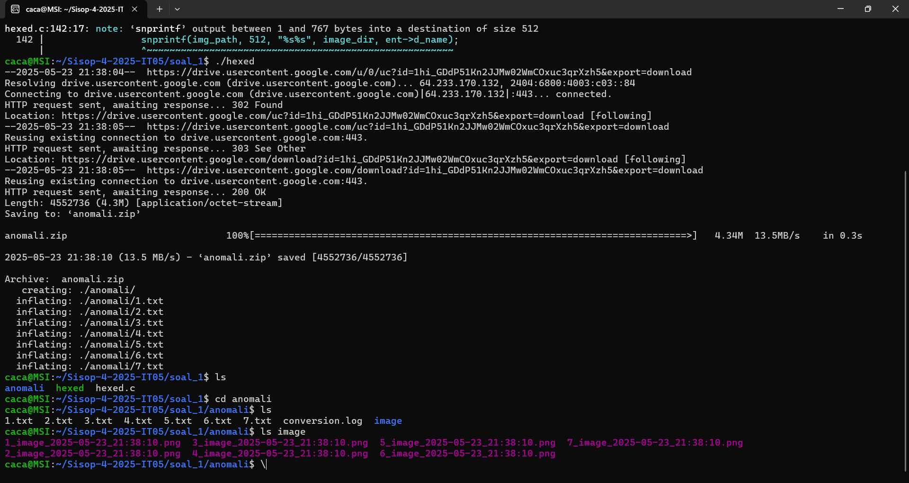
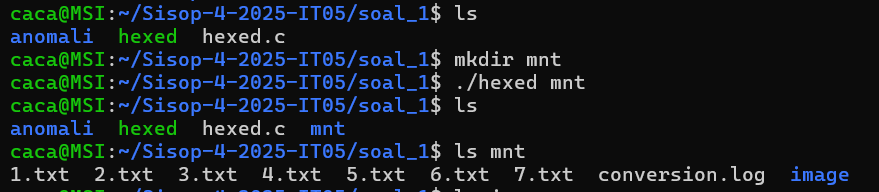
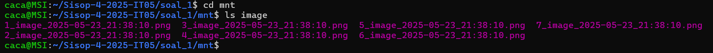
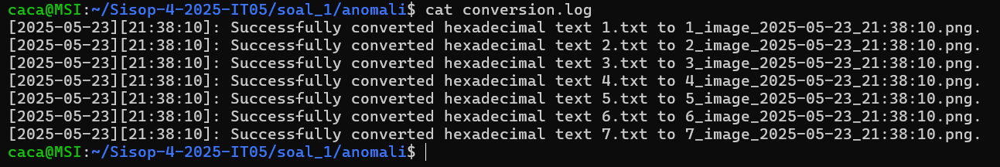
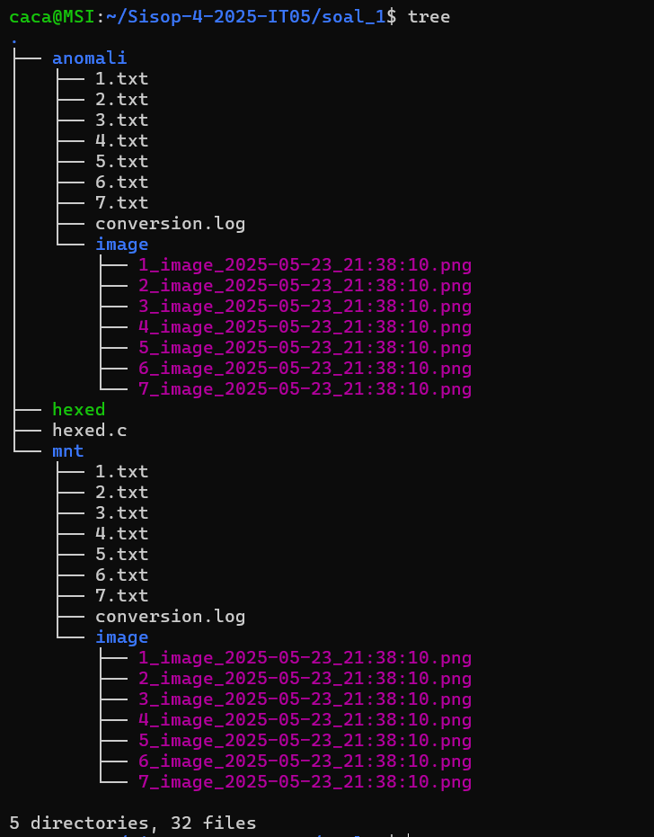

# Sisop-4-2025-IT05
# Soal 1

### Code Block
```c
#define FUSE_USE_VERSION 31
```

### Explanation
> - This line specifies that we're using FUSE API version 3.1, ensuring compatibility with the right header and library functions.

### Code Block
```c
#define FUSE_USE_VERSION 31
```

### Explanation
> - This defines the base directory where the .txt files and converted .png images reside.

## Sub Soal a

### Overview
Shorekeeper retrieves a set of anomaly samples provided as a .zip file from a given URL.
The program must:

Download the zip file

Extract its contents

Automatically delete the zip file afterward
Goal: Prepare the initial dataset of .txt files for further processing.

### Input/&Output



### Code Block
```c
void run_command(char *cmd[]) {
    pid_t pid = fork();
    if (pid == 0) {
        execvp(cmd[0], cmd);
        perror("execvp gagal");
        exit(EXIT_FAILURE);
    } else {
        int status;
        waitpid(pid, &status, 0);
    }
}
```

### Explanation

> - Executes a given shell command (like wget or unzip) using fork() and execvp().

### Code Block
```c
void download_and_unzip() {
    struct stat st;
    if (stat(base_dir, &st) == 0 && S_ISDIR(st.st_mode)) return;

    char *wget_cmd[] = {...};
    run_command(wget_cmd);

    char *unzip_cmd[] = {...};
    run_command(unzip_cmd);

    unlink("anomali.zip");
}
```

### Explanation

> - Checks if the data directory exists. If not, downloads and extracts the ZIP file containing .txt data.


### Sub soal b

### Overview
Upon inspection, each .txt file contains hexadecimal strings instead of readable text.
Shorekeeper realizes the files are encoded and may represent binary data such as images.
Whenever a .txt file is accessed from the mounted directory (via FUSE), its content should be automatically converted into a .png image.
Goal: Understand that each file contains encoded hex that must be transformed.
Goal: Transparently transform .txt (hex) into .png (image) on access using FUSE.

### Input & Output


### Code Block
```c
unsigned char hex_to_byte(const char *hex) {
    unsigned char byte;
    sscanf(hex, "%2hhx", &byte);
    return byte;
}
```

### Explanation
> - Used during the conversion of .txt files that contain hexadecimal representations.

### Code Block
```c
void process_all_files() {
    for (int i = 1; i <= 7; i++) {
        char path[512];
        snprintf(path, sizeof(path), "%s/%d.txt", base_dir, i);
        convert_file_to_image(path);
    }
}
```

### Explanation

> - Loops from 1.txt to 7.txt, converting each one if available.

##### FUSE Function

### Input & Output


### Code Block
```c
int is_txt_file(const char *path) {
    return strstr(path, ".txt") != NULL;
}
```

### Explanation

> - Helper to identify whether the current file is a .txt (eligible for conversion).

### Code Block
```c
void get_real_path(char fpath[512], const char *path) {
    snprintf(fpath, 512, "%s%s", base_dir, path);
}

```

### Explanation

> - Generates the full path of a file by appending the virtual path to the base directory.

### Code Block
```c
void get_image_path(char img_path[512], const char *txt_path) {
    char name_only[64] = {0};
    const char *filename = strrchr(txt_path, '/');
    filename = (filename) ? filename + 1 : txt_path;
    strncpy(name_only, filename, strcspn(filename, "."));

    char image_dir[512];
    snprintf(image_dir, sizeof(image_dir), "%s/image/", base_dir);

    DIR *dir = opendir(image_dir);
    if (dir) {
        struct dirent *ent;
        while ((ent = readdir(dir)) != NULL) {
            if (strstr(ent->d_name, name_only) && strstr(ent->d_name, ".png")) {
                snprintf(img_path, 512, "%s%s", image_dir, ent->d_name);
                break;
            }
        }
        closedir(dir);
    }
}
```

### Explanation

> - Given a .txt file, tries to locate the corresponding .png inside anomali/image.

### Code Block
```c
int x_getattr(const char *path, struct stat *stbuf, struct fuse_file_info *fi) {
    (void) fi;
    char fpath[512];
    if (is_txt_file(path)) {
        char img_path[512] = {0};
        get_image_path(img_path, path);
        if (strlen(img_path) > 0)
            return lstat(img_path, stbuf);
    }
    get_real_path(fpath, path);
    return lstat(fpath, stbuf);
}
```

### Explanation

> - Provides file attributes for .png or .txt, depending on availability.

### Code Block
```c
int x_readdir(const char *path, void *buf, fuse_fill_dir_t filler, off_t offset,
              struct fuse_file_info *fi, enum fuse_readdir_flags flags) {
    (void) offset;
    (void) fi;
    (void) flags;

    char fpath[512];
    get_real_path(fpath, path);
    DIR *dp = opendir(fpath);
    if (!dp) return -errno;

    filler(buf, ".", NULL, 0, 0);
    filler(buf, "..", NULL, 0, 0);
    struct dirent *de;
    while ((de = readdir(dp)) != NULL) {
        filler(buf, de->d_name, NULL, 0, 0);
    }
    closedir(dp);
    return 0;
}
```

### Explanation

> - Reads directory contents and fills them into the virtual filesystem.

### Code Block
```c
int x_open(const char *path, struct fuse_file_info *fi) {
    char fpath[512];
    if (is_txt_file(path)) {
        char img_path[512] = {0};
        get_image_path(img_path, path);
        if (strlen(img_path) > 0)
            snprintf(fpath, sizeof(fpath), "%s", img_path);
        else
            get_real_path(fpath, path);
    } else {
        get_real_path(fpath, path);
    }

    int fd = open(fpath, fi->flags);
    if (fd == -1) return -errno;
    close(fd);
    return 0;
}
```

### Explanation

> - Opens .png if it exists instead of .txt, making the switch transparent.

### Code Block
```c
int x_read(const char *path, char *buf, size_t size, off_t offset, struct fuse_file_info *fi) {
    char fpath[512];
    if (is_txt_file(path)) {
        char img_path[512] = {0};
        get_image_path(img_path, path);
        if (strlen(img_path) > 0)
            snprintf(fpath, sizeof(fpath), "%s", img_path);
        else
            get_real_path(fpath, path);
    } else {
        get_real_path(fpath, path);
    }

    int fd = open(fpath, O_RDONLY);
    if (fd == -1) return -errno;
    int res = pread(fd, buf, size, offset);
    if (res == -1) res = -errno;
    close(fd);
    return res;
}
```

### Explanation

> - Reads the .png version of a file if available. Otherwise, reads the raw .txt.

### Code Block
```c
struct fuse_operations x_oper = {
    .getattr = x_getattr,
    .readdir = x_readdir,
    .open    = x_open,
    .read    = x_read,
};
```

### Explanation

> - Declares the functions used by the FUSE filesystem interface.

### Code Block
```c
int main(int argc, char *argv[]) {
    if (argc >= 2) {
        ...
        return fuse_main(...);
    } else {
        download_and_unzip();
        process_all_files();
        return 0;
    }
}

```

### Explanation

> - If run with an argument (mount point), the FUSE filesystem is mounted.
Otherwise, it just runs the downloader and converter.


### Sub soal c

### Overview
Each generated image must follow a specific naming format:
```[original_filename]_image_[YYYY-mm-dd]_[HH:MM:SS].png```
Goal: Ensure each image file is uniquely timestamped and traceable to its source .txt.

### Input & Output


### Code Block
```c
void convert_file_to_image(const char *filename_txt) {
    FILE *input = fopen(filename_txt, "r");
    if (!input) return;

    const char *basename = strrchr(filename_txt, '/');
    basename = (basename) ? basename + 1 : filename_txt;

    char name_only[64] = {0};
    strncpy(name_only, basename, strcspn(basename, "."));

    char date[16], time[16];
    get_timestamp(date, sizeof(date), time, sizeof(time));

    char image_dir[512];
    snprintf(image_dir, sizeof(image_dir), "%s/image", base_dir);
    mkdir(image_dir, 0755);

    char output_path[512];
    snprintf(output_path, sizeof(output_path), "%s/%s_image_%s_%s.png", image_dir, name_only, date, time);
    FILE *output = fopen(output_path, "wb");
    if (!output) {
        fclose(input);
        return;
    }

    char hex[3];
    int c, count = 0;
    while ((c = fgetc(input)) != EOF) {
        if (isxdigit(c)) {
            hex[count++] = c;
            if (count == 2) {
                hex[2] = '\0';
                unsigned char byte = hex_to_byte(hex);
                fwrite(&byte, 1, 1, output);
                count = 0;
            }
        }
    }

    fclose(input);
    fclose(output);

    char log_name[128];
    snprintf(log_name, sizeof(log_name), "%s_image_%s_%s.png", name_only, date, time);
    log_conversion(basename, log_name, date, time);
}
```

### Explanation

> - Reads hex data from .txt, decodes it, and writes to a binary .png file with a timestamped filename.

### Sub soal d

### Overview
Every successful conversion must be recorded in a conversion.log file inside the anomali directory.
The log entry format:
```[YYYY-mm-dd][HH:MM:SS]: Successfully converted hexadecimal text [filename] to [output_image_name].```

### Input & Output


### Code Block
```c
void get_timestamp(char *date_str, size_t size1, char *time_str, size_t size2) {
    time_t t = time(NULL);
    struct tm *tm_info = localtime(&t);
    strftime(date_str, size1, "%Y-%m-%d", tm_info);
    strftime(time_str, size2, "%H:%M:%S", tm_info);
}

void log_conversion(const char *txt_name, const char *png_name, const char *date, const char *time) {
    char log_path[512];
    snprintf(log_path, sizeof(log_path), "%s/conversion.log", base_dir);
    FILE *log = fopen(log_path, "a");
    if (log) {
        fprintf(log, "[%s][%s]: Successfully converted hexadecimal text %s to %s.\n", date, time, txt_name, png_name);
        fclose(log);
    }
}
```

### Explanation

> - Fills in current date and time, used in naming converted image files and logs.
> - Logs each conversion process into a file called conversion.log.

### Input & Output



# Soal 2

## Sub Soal a

### Overview
Making the directory for the fuse

### Code Block
```bash
$ wget -O relics.zip "https://drive.usercontent.google.com/u/0/uc?id=1MHVhFT57Wa9Zcx69Bv9j5ImHc9rXMH1c&export=download"

$ unzip relics.zip -d relics

$ mkdir mount_dir
` ``
### Code Block (Dockerfile)
```
### Input & Output


## Sub Soal b

### Overview
mounting mount_dir and can assemble fragments from relics directory that forms a file (default Baymax.jpeg) that can be read, shown, and copied


### Code Block
```c
static int baymax_getattr(const char *path, struct stat *stbuf) {
    memset(stbuf, 0, sizeof(struct stat)); // clear stat struct memory
    
    // if it's a root directory
    if (strcmp(path, "/") == 0) { 
        stbuf->st_mode = S_IFDIR | 0755; // set as directory with read, write, execute permissions
        stbuf->st_nlink = 2; // links to "." and ".."
        return 0; 
    }

    char base_path[PATH_MAX]; // base path for the file
    get_base_path(path, base_path); // get the base path from the full path

    DIR *dir = opendir(RELICS_DIR); // open relics directory
    if (!dir) return -errno; // if it fails to open the directory

    off_t total_size = 0; // total size of the file
    struct dirent *entry; // entry struct for the directory
    int file_exists_as_fragments = 0; // flag to check if the file exists as fragments

    while ((entry = readdir(dir))) {
        if(strncmp(entry->d_name, base_path, strlen(base_path)) == 0) {
            char *dot = strrchr(entry->d_name, '.'); // find the last dot in the name
            if (dot && strlen(dot) == 4 && isdigit(dot[1]) && isdigit(dot[2]) && isdigit(dot[3])) { // if the name has a dot and the next 3 characters are digits
                file_exists_as_fragments = 1; // set the flag to true, meaning the file exists as fragments or exists beforehand
                char full_path[PATH_MAX]; // full path for the fragment
                snprintf(full_path, sizeof(full_path), "%s/%s", RELICS_DIR, entry->d_name); // make the full path
                struct stat fragment_stat;
                if (stat(full_path, &fragment_stat) == 0) {
                    total_size += fragment_stat.st_size;
                }
            }
        }
    }
    closedir(dir); // close the directory

    if (file_exists_as_fragments) {
        stbuf->st_mode = S_IFREG | 0666; // regular file with read-only permission
        stbuf->st_size = total_size; // set the size of the file
        stbuf->st_nlink = 1; // one link to the file
        return 0; 
    }

    return -ENOENT; // file not found
}

static int baymax_readdir(const char *path, void *buf, fuse_fill_dir_t filler, off_t offset, struct fuse_file_info *fi) {
    (void) offset; // unused parameter
    (void) fi; // unused parameter

    if (strcmp(path, "/") != 0) return -ENOENT; // if the path is not root directory, meaning "No such file or directory" error

    filler(buf, ".", NULL, 0); // current directory
    filler(buf, "..", NULL, 0); // parent directory

    DIR *dir = opendir(RELICS_DIR); // open relics directory
    if (!dir) return -errno; // if it fails to open the directory

    char unique_files[256][256] = {0}; // array to store unique file names
    int unique_count = 0; // count of unique files

    
    struct dirent *entry; // entry for the directory
    while ((entry = readdir(dir))) {
        char *name = entry->d_name; // get the name of the entry
        if (strcmp(name, ".") == 0 || strcmp(name, "..") == 0) continue; // skip current and parent directory

        char *dot = strrchr(name, '.'); // find the dot in the file name
        if (dot && strlen(dot) == 4 && isdigit(dot[1]) && isdigit(dot[2]) && isdigit(dot[3])) { // if the name has a dot and the next 3 characters are digits
            char base_name[256];
            strncpy(base_name, name, dot - name);
            base_name[dot - name] = '\0'; // null-terminate the base name

            int is_duplicate = 0; // flag for duplicate check
            for (int i = 0; i < unique_count; i++) {
                if (strcmp(unique_files[i], base_name) == 0) { // if the file name is already in the list
                    is_duplicate = 1; // set duplicate flag
                    break;
                }
            }

            if (!is_duplicate && unique_count < 256) { // if it's a unique file
                strcpy(unique_files[unique_count++], base_name); // add to the list
                filler(buf, base_name, NULL, 0); // add to the buffer
            }
        }
    }
    closedir(dir);
    return 0; 
}

static int baymax_open (const char *path, struct fuse_file_info *fi) {
    char base[PATH_MAX]; 
    get_base_path(path, base); 

    struct file_handle *fh = malloc(sizeof(struct file_handle)); 
    if (!fh) return -ENOMEM; 

    // Initialize file_handle members
    fh->total_read = 0;
    fh->file_size = 0;
    fh->written = 0;
    fh->written_fragments[0] = '\0';
    fi->fh = (uint64_t)(uintptr_t)fh; // Store pointer to fh in fuse_file_info

    struct stat st;
    // Iterate through potential fragments to calculate total file size
    for (int frag_idx = 0; ; ++frag_idx) {
        char current_fragment_path[PATH_MAX]; 
        snprintf(current_fragment_path, sizeof(current_fragment_path), "%s/%s.%03d", RELICS_DIR, base, frag_idx); 
        if (stat(current_fragment_path, &st) == 0) { // Check if fragment exists
            fh->file_size += st.st_size; // Add fragment size to total
        } else {
            break; // No more fragments for this file
        }
    }
    return 0; 
}

static int baymax_read(const char *path, char *buf, size_t size, off_t offset, struct fuse_file_info *fi) {
    struct file_handle *fh = (struct file_handle *)(uintptr_t)fi->fh; 
    char base_path[PATH_MAX]; 
    get_base_path(path, base_path); 

    char *fragments[1000]; // Array to store fragment names
    int fragment_count = 0; 

    DIR *dir = opendir(RELICS_DIR); 
    if (!dir) return -errno; 

    // Collect all fragments for the base_path
    struct dirent *entry; 
    while((entry = readdir(dir)) && fragment_count < 1000) {
        if (strncmp(entry->d_name, base_path, strlen(base_path)) == 0) { 
            char *dot = strrchr(entry->d_name, '.'); 
            if (dot && strlen(dot) == 4 && isdigit(dot[1]) && isdigit(dot[2]) && isdigit(dot[3])) { 
                fragments[fragment_count++] = strdup(entry->d_name); 
            }
        }
    }
    closedir(dir); 

    // Sort fragments numerically by their extension (e.g., .000, .001, .002)
    for (int i = 0; i < fragment_count; i++) {
        for (int j = i + 1; j < fragment_count; j++) {
            if (atoi(strrchr(fragments[i], '.') + 1) > atoi(strrchr(fragments[j], '.') + 1)) {
                char *temp = fragments[i];
                fragments[i] = fragments[j];
                fragments[j] = temp;
            }
        }
    }
    
    size_t bytes_read = 0; 
    off_t current_offset_across_fragments = 0; // Tracks cumulative offset across all fragments

    // Read data from sorted fragments
    for (int i = 0; i < fragment_count && bytes_read < size; i++) {
        char fragment_path[PATH_MAX];
        snprintf(fragment_path, sizeof(fragment_path), "%s/%s", RELICS_DIR, fragments[i]); 

        FILE *f = fopen(fragment_path, "rb");
        if (!f) {
            free(fragments[i]); 
            continue; 
        }

        fseek(f, 0, SEEK_END); 
        off_t fragment_size = ftell(f); 
        rewind(f); 

        // Check if the current fragment is relevant to the read request (offset and size)
        if (offset < current_offset_across_fragments + fragment_size) { 
            // Calculate offset within this specific fragment
            off_t fragment_internal_offset = (offset > current_offset_across_fragments) ? (offset - current_offset_across_fragments) : 0;
            fseek(f, fragment_internal_offset, SEEK_SET); 

            // Calculate how much to read from this fragment
            size_t read_size_from_fragment = fmin(size - bytes_read, fragment_size - fragment_internal_offset); 
            size_t result = fread(buf + bytes_read, 1, read_size_from_fragment, f); 
            if (result > 0) {
                bytes_read += result; 
            }
        }

        current_offset_across_fragments += fragment_size; 
        fclose(f); 
        free(fragments[i]); // Free duplicated fragment name
    }

    fh->total_read += bytes_read; // Update total bytes read in file_handle
    return bytes_read; 
}
```

### Explanation
When FUSE operation is called the system needs the file attributes, which is the code block below: 
```c
static int baymax_getattr(const char *path, struct stat *stbuf) {
    memset(stbuf, 0, sizeof(struct stat)); // clear stat struct memory
    
    // if it's a root directory
    if (strcmp(path, "/") == 0) { 
        stbuf->st_mode = S_IFDIR | 0755; // set as directory with read, write, execute permissions
        stbuf->st_nlink = 2; // links to "." and ".."
        return 0; 
    }

    char base_path[PATH_MAX]; // base path for the file
    get_base_path(path, base_path); // get the base path from the full path

    DIR *dir = opendir(RELICS_DIR); // open relics directory
    if (!dir) return -errno; // if it fails to open the directory

    off_t total_size = 0; // total size of the file
    struct dirent *entry; // entry struct for the directory
    int file_exists_as_fragments = 0; // flag to check if the file exists as fragments

    while ((entry = readdir(dir))) {
        if(strncmp(entry->d_name, base_path, strlen(base_path)) == 0) {
            char *dot = strrchr(entry->d_name, '.'); // find the last dot in the name
            if (dot && strlen(dot) == 4 && isdigit(dot[1]) && isdigit(dot[2]) && isdigit(dot[3])) { // if the name has a dot and the next 3 characters are digits
                file_exists_as_fragments = 1; // set the flag to true, meaning the file exists as fragments or exists beforehand
                char full_path[PATH_MAX]; // full path for the fragment
                snprintf(full_path, sizeof(full_path), "%s/%s", RELICS_DIR, entry->d_name); // make the full path
                struct stat fragment_stat;
                if (stat(full_path, &fragment_stat) == 0) {
                    total_size += fragment_stat.st_size;
                }
            }
        }
    }
    closedir(dir); // close the directory

    if (file_exists_as_fragments) {
        stbuf->st_mode = S_IFREG | 0666; // regular file with read-only permission
        stbuf->st_size = total_size; // set the size of the file
        stbuf->st_nlink = 1; // one link to the file
        return 0; 
    }

    return -ENOENT; // file not found
}
```

For further explanation is below: 
1. **Initialization**: `memset(stbuf, 0, sizeof(struct stat))` clears the `stat` buffer.
2. **Root Directory Handling**: If `path` is `/`, it sets `stbuf` for a directory (`S_IFDIR | 0755`) with 2 links (`.` and `..`) and returns.
3. **Get Base Filename**: For other paths, `get_base_path` extracts the filename (e.g., `Baymax.jpeg` from `/Baymax.jpeg`).
4. **Scan RELICS_DIR**:
- Opens the `RELICS_DIR` (defined as `./relics`).
- Iterates through entries in `RELICS_DIR`.
- For each entry, it checks if the entry name starts with `base_path` and is followed by a fragment identifier (e.g., `.000`, `.001`). This check `(dot && strlen(dot) == 4 && isdigit(dot[1]) && isdigit(dot[2]) && isdigit(dot[3]))` ensures it only considers valid fragments.
- If a fragment is found
- - `file_exists_as_fragments` is set to 1.
-The full path to the fragment within `RELICS_DIR` is constructed.
- - `stat()` is called on the fragment to get its size.
- - The fragment's size is added to `total_size`.
5. **Set File Attributes**: If `file_exists_as_fragments` is true (meaning at least one fragment was found):
- `stbuf->st_mode` is set to `S_IFREG | 0666`, indicating a regular file with read and write permissions for owner, group, and others.
- `stbuf->st_size` is set to the calculated `total_size` (sum of all fragment sizes).
- `stbuf->st_nlink` is set to 1
6. **File Not Found**: If no fragments are found for the given `base_path`, it returns `-ENOENT` (No such file or directory).

But to list the virtual files in the mounted directory, the needed code block is below: 
```c
static int baymax_readdir(const char *path, void *buf, fuse_fill_dir_t filler, off_t offset, struct fuse_file_info *fi) {
    (void) offset; // unused parameter
    (void) fi; // unused parameter

    if (strcmp(path, "/") != 0) return -ENOENT; // if the path is not root directory, meaning "No such file or directory" error

    filler(buf, ".", NULL, 0); // current directory
    filler(buf, "..", NULL, 0); // parent directory

    DIR *dir = opendir(RELICS_DIR); // open relics directory
    if (!dir) return -errno; // if it fails to open the directory

    char unique_files[256][256] = {0}; // array to store unique file names
    int unique_count = 0; // count of unique files

    
    struct dirent *entry; // entry for the directory
    while ((entry = readdir(dir))) {
        char *name = entry->d_name; // get the name of the entry
        if (strcmp(name, ".") == 0 || strcmp(name, "..") == 0) continue; // skip current and parent directory

        char *dot = strrchr(name, '.'); // find the dot in the file name
        if (dot && strlen(dot) == 4 && isdigit(dot[1]) && isdigit(dot[2]) && isdigit(dot[3])) { // if the name has a dot and the next 3 characters are digits
            char base_name[256];
            strncpy(base_name, name, dot - name);
            base_name[dot - name] = '\0'; // null-terminate the base name

            int is_duplicate = 0; // flag for duplicate check
            for (int i = 0; i < unique_count; i++) {
                if (strcmp(unique_files[i], base_name) == 0) { // if the file name is already in the list
                    is_duplicate = 1; // set duplicate flag
                    break;
                }
            }

            if (!is_duplicate && unique_count < 256) { // if it's a unique file
                strcpy(unique_files[unique_count++], base_name); // add to the list
                filler(buf, base_name, NULL, 0); // add to the buffer
            }
        }
    }
    closedir(dir);
    return 0; 
}
```

For further explanation, below: 
1. **Parameter** Handling: `offset` and `fi` are marked as unused.
2. **Path Check**: Ensures that only the root directory (`/`) can be listed. If any other path is given, it returns `-ENOENT`.
3. **Add Standard Entries**: `filler(buf, ".", NULL, 0)` and `filler(buf, "..", NULL, 0)` add the current and parent directory entries to the listing.
4. **Scan `RELICS_DIR`**:
- Opens `RELICS_DIR`.
- `unique_files` array and `unique_count` are used to keep track of base filenames already added to avoid duplicates (since multiple fragments like `file.000`, `file.001` belong to the same virtual file `file`).
- Iterates through entries in `RELICS_DIR`.
- Skips `.` and `..` entries from `RELICS_DIR`.
5. Fragment Identification and Basename Extraction:
- Checks if an entry is a fragment (e.g., `name.NNN`).
- If it is, `strncpy` extracts the base filename (the part before the `.NNN` extension).
6. **Duplicate Check & Add to Listing**:
- Checks if this `base_name` has already been added to `unique_files`.
- If it's not a duplicate and there's space in `unique_files`, the `base_name` is added to `unique_files` and then passed to the `filler` function. The `filler` function is provided by FUSE to add entries to the directory listing buffer.
7. **Cleanup**: Closes `RELICS_DIR`.

For the function in the FUSE filesystem when opening a file is the code below: 

```c
static int baymax_open (const char *path, struct fuse_file_info *fi) {
    char base[PATH_MAX]; // base path for the file
    get_base_path(path, base); // get the base path from the full path

    struct file_handle *fh = malloc(sizeof(struct file_handle)); // allocate memory for file handle
    if (!fh) return -ENOMEM; // if it fails to allocate memory

    fh->total_read = 0;
    fh->file_size = 0;
    fh->written = 0;
    fh->written_fragments[0] = '\0';
    fi->fh = (uint64_t)(uintptr_t)fh;

    struct stat st;
    for (int frag_idx = 0; ; ++frag_idx) {
        char current_fragment_path[PATH_MAX]; 
        snprintf(current_fragment_path, sizeof(current_fragment_path), "%s/%s.%03d", RELICS_DIR, base, frag_idx); // make the path for the fragment
        if (stat(current_fragment_path, &st) == 0) { // check if the fragment exists
            fh->file_size += st.st_size; // update the file size
        } else {
            break; // exit the loop if the fragment doesn't exist
        }
    }
    // if file !existed, fh->file_size = 0;
    return 0; 
}
```

For further explaation, below: 
1. **Get Base Filename**: `get_base_path` extracts the filename from the `path`.
2. **Allocate** `file_handle`: Memory is allocated for a `struct file_handle`. If allocation fails, `-ENOMEM` (Out of memory) is returned.
3. **Initialize** `file_handle`:
- `fh->total_read` is set to 0.
- `fh->file_size` is initialized to 0 (it will be calculated next).
- `fh->written` is set to 0 (no writes have occurred yet).
- `fh->written_fragments` is initialized to an empty string.
- The pointer `fh` is cast and stored in `fi->fh`. This allows other FUSE operations (like `read`, `write`, `release`) to access this file-specific data.
4. **Calculate Total File Size**:
- A loop iterates, checking for fragments named `base.000`, `base.001`, `base.002`, and so on, within `RELICS_DIR`.
- `snprintf` constructs the full path to each potential fragment.
- `stat(current_fragment_path, &st)` is used to check if the fragment exists and to get its attributes (specifically, its size).
- If a fragment exists (`stat` returns 0), its size (`st.st_size`) is added to `fh->file_size`.
- If a fragment does not exist (`stat` returns non-zero), it's assumed there are no more fragments for this file, and the loop breaks.

Meanwhile to combine the files from relics is by using the code block below: 
```c
static int baymax_read(const char *path, char *buf, size_t size, off_t offset, struct fuse_file_info *fi) {
    struct file_handle *fh = (struct file_handle *)(uintptr_t)fi->fh; // get the file handle
    char base_path[PATH_MAX]; // base path for the file
    get_base_path(path, base_path); // get the base path from the full path

    char *fragments[1000];
    int fragment_count = 0; // count of fragments

    DIR *dir = opendir(RELICS_DIR); // open relics directory
    if (!dir) return -errno; // if it fails to open the directory

    struct dirent *entry; // entry for the directory
    while((entry = readdir(dir)) && fragment_count < 1000) {
        if (strncmp(entry->d_name, base_path, strlen(base_path)) == 0) { // if the name starts with the base path
            char *dot = strrchr(entry->d_name, '.'); // find the dot in the file name
            if (dot && strlen(dot) == 4 && isdigit(dot[1]) && isdigit(dot[2]) && isdigit(dot[3])) { // if the name has a dot and the next 3 characters are digits
                fragments[fragment_count++] = strdup(entry->d_name); // add to the fragments list
            }
        }
    }

    closedir(dir); // close the directory

    for (int i = 0; i < fragment_count; i++) {
        for (int j = i + 1; j < fragment_count; j++) {
            if (atoi(strrchr(fragments[i], '.') + 1) > atoi(strrchr(fragments[j], '.') + 1)) {
                char *temp = fragments[i];
                fragments[i] = fragments[j];
                fragments[j] = temp;
            }
        }
    }
    
    size_t bytes_read = 0; 
    off_t current_offset = 0; 

    for (int i = 0; i < fragment_count && bytes_read < size; i++) {
        char fragment_path[PATH_MAX];
        snprintf(fragment_path, sizeof(fragment_path), "%s/%s", RELICS_DIR, fragments[i]); // make the fragment path

        FILE *f = fopen(fragment_path, "rb");
        if (!f) {
            free(fragments[i]); // free the memory
            continue; // if it fails to open the fragment, skip
        }

        fseek(f, 0, SEEK_END); // go to the end of the file
        off_t fragment_size = ftell(f); // get the size of the fragment
        rewind(f); // rewind to the beginning of the file

        if (offset < current_offset + fragment_size) { // if the fragment overlaps with the offset
            off_t fragment_offset = (offset > current_offset) ? (offset - current_offset) : 0;
            fseek(f, fragment_offset, SEEK_SET); // calculate the offset in the fragment

            size_t read_size = fmin(size - bytes_read, fragment_size - fragment_offset); // calculate the size to read
            size_t result = fread(buf + bytes_read, 1, read_size, f); // read the data from the fragment
            if (result > 0) {
                bytes_read += result; // update the bytes read
            }
        }

        current_offset += fragment_size; // update the current offset
        fclose(f); // close the fragment
        free(fragments[i]); // free the memory
    }

    fh->total_read += bytes_read; // update the total read size
    return bytes_read; // return the number of bytes read
}
```
1. Retrieve file_handle and base_path: Gets the file-specific data and the base filename.
2. Collect Fragment Names:
- Opens RELICS_DIR.
- Iterates through RELICS_DIR, finding all entries that are fragments of base_path (e.g., base_path.000, base_path.001).
- strdup is used to copy these fragment names into the fragments array.
3. Sort Fragments:
- The collected fragment names are sorted numerically based on their extension (e.g., .000 comes before .001). This is crucial for reconstructing the file in the correct order. A simple bubble sort is used.
4. Read Data Sequentially:
- bytes_read tracks how many bytes have been read into the user's buffer buf so far.
- current_offset_across_fragments tracks the cumulative size of fragments processed so far, to determine where the global offset falls.
- The code iterates through the sorted fragments:
- - Constructs the full path to the current fragment in RELICS_DIR.
- - Opens the fragment in read binary mode ("rb").
- - Determines fragment_size.
- - Offset Calculation: It checks if the requested read offset falls within or before the current fragment.
- - - fragment_internal_offset: If the global offset is within this fragment, this calculates the starting point for reading within this fragment.
- - - fseek positions the file pointer within the fragment.
- - Read Size Calculation: read_size_from_fragment determines how many bytes to read from the current fragment. It's the minimum of:
- - Remaining bytes requested by the user (size - bytes_read).
- - Remaining bytes in the current fragment from fragment_internal_offset (fragment_size - fragment_internal_offset).
- fread reads the data into the user's buffer buf at the correct position (buf + bytes_read).
- bytes_read is updated with the amount actually read.
- The current_offset_across_fragments is updated with the size of the processed fragment.
- The fragment file is closed, and the memory for fragments[i] (from strdup) is freed.
5. Update total_read: The fh->total_read in the file_handle is updated with the total bytes_read in this call.
6. Returns the total number of bytes_read.

## Sub Soal c

### Overview
make new file in mounted directory that can automatically separates them into fragments of 1KB in relics directory

### Input/Output


### Code Block 
```c
static int baymax_write(const char *path, const char *buf, size_t size, off_t offset, struct fuse_file_info *fi) {
    char base_path[PATH_MAX]; // base path for the file
    get_base_path(path, base_path); // get the base path from the full path

    struct file_handle *fh = (struct file_handle *)(uintptr_t)fi->fh; // get the file handle
    fh->written = 1; // set the written flag
    
    int start_fragment_num = offset / FRAGMENT_SIZE; // calculate the starting fragment number
    off_t offset_first_fragment = offset % FRAGMENT_SIZE; // calculate the offset in the first fragment
    size_t remaining_size = size; // remaining size to write
    size_t written_so_far = 0; // bytes written so far
    int current_fragment_num = start_fragment_num; 

    while (remaining_size > 0) {
        char fragment_path[PATH_MAX];
        snprintf(fragment_path, sizeof(fragment_path), "%s/%s.%03d", RELICS_DIR, base_path, current_fragment_num); // make the fragment path

        char fragment_basename[256];
        snprintf(fragment_basename, sizeof(fragment_basename), "%s.%03d", base_path, current_fragment_num); // make the fragment basename
        if (strstr(fh->written_fragments, fragment_basename) == NULL) { // if the fragment is not already in the list
            if (strlen(fh->written_fragments) > 0) {
                strcat(fh->written_fragments, ", "); // add a comma if it's not the first fragment
            }
            strcat(fh->written_fragments, fragment_basename); // add the fragment basename to the list
        }

        FILE *f = fopen(fragment_path, "r+b"); // open the fragment if file exists
        if (!f) {
            f = fopen(fragment_path, "wb"); // create the fragment if it doesn't exist
        }
        if (!f) return -errno; // if it fails to create the fragment, return error

        off_t current_offset = (current_fragment_num == start_fragment_num) ? offset_first_fragment : 0; // set the offset in the fragment
        fseek(f, current_offset, SEEK_SET); // set the offset in the fragment

        size_t write_size = fmin(remaining_size, FRAGMENT_SIZE - current_offset); // calculate the size to write
        size_t bytes_written = fwrite(buf + written_so_far, 1, write_size, f); // write the data to the fragment
        fclose(f); // close the fragment

        if (bytes_written < write_size) return -EIO; // if it fails to write, return error

        written_so_far += bytes_written; // update the bytes written
        remaining_size -= bytes_written; // update the remaining size
        current_fragment_num++; // increment the fragment number
    }
    
    return size;
}

static int baymax_create(const char *path, mode_t mode, struct fuse_file_info *fi) {
    (void) mode; // unused parameter
    
    char base[PATH_MAX]; // base path for the file
    get_base_path(path, base); // get the base path from the full path

    char existing_check_path[PATH_MAX];
    snprintf(existing_check_path, sizeof(existing_check_path), "%s/%s.000", RELICS_DIR, base); // make the path for the existing check
    if (access(existing_check_path, F_OK) == 0) { // check if the file already exists
        return -EEXIST; // file already exists
    }
    
    struct file_handle *fh = malloc(sizeof(struct file_handle)); // allocate memory for file handle
    if (!fh) return -ENOMEM; // if it fails to allocate memory

    fh->file_size = 0; // set the size of the file
    fh->total_read = 0; // set the total read size
    fh->written = 0; // set the written flag
    fh->written_fragments[0] = '\0'; // initialize the written fragments list for log buffer
    fi->fh = (uint64_t)(uintptr_t)fh; // set the file handle

    char fragment_path[PATH_MAX];
    snprintf(fragment_path, sizeof(fragment_path), "%s/%s.000", RELICS_DIR, base); // make the fragment path

    FILE *f = fopen(fragment_path, "wb"); // open the fragment for writing
    if (f){
        fclose(f); // close the fragment
        log_activity("CREATE", base); // log the create activity
    } else {
        free(fh); // free the memory if it fails to open
        return -errno; // return error
    }

    return 0;
}
```

### Explanation
For creating the files, the baymax_create and baymax_release are esential
```c
static int baymax_create(const char *path, mode_t mode, struct fuse_file_info *fi) {
    (void) mode; // unused parameter
    
    char base[PATH_MAX]; // base path for the file
    get_base_path(path, base); // get the base path from the full path

    char existing_check_path[PATH_MAX];
    snprintf(existing_check_path, sizeof(existing_check_path), "%s/%s.000", RELICS_DIR, base); // make the path for the existing check
    if (access(existing_check_path, F_OK) == 0) { // check if the file already exists
        return -EEXIST; // file already exists
    }
    
    struct file_handle *fh = malloc(sizeof(struct file_handle)); // allocate memory for file handle
    if (!fh) return -ENOMEM; // if it fails to allocate memory

    fh->file_size = 0; // set the size of the file
    fh->total_read = 0; // set the total read size
    fh->written = 0; // set the written flag
    fh->written_fragments[0] = '\0'; // initialize the written fragments list for log buffer
    fi->fh = (uint64_t)(uintptr_t)fh; // set the file handle

    char fragment_path[PATH_MAX];
    snprintf(fragment_path, sizeof(fragment_path), "%s/%s.000", RELICS_DIR, base); // make the fragment path

    FILE *f = fopen(fragment_path, "wb"); // open the fragment for writing
    if (f){
        fclose(f); // close the fragment
        log_activity("CREATE", base); // log the create activity
    } else {
        free(fh); // free the memory if it fails to open
        return -errno; // return error
    }

    return 0;
}
```

Furhter explanation: 
1. Parameter Handling: mode is marked as unused. The file permissions will be default or handled by baymax_getattr.
2. Get Base Filename: get_base_path extracts the filename.
3. Existence Check:
- Constructs the path to where the first fragment (base.000) would be in RELICS_DIR.
- access(existing_check_path, F_OK) checks if this fragment already exists.
- If it exists, -EEXIST (File exists) is returned, as per standard filesystem behavior.
4. Allocate and Initialize file_handle:
- A struct file_handle (fh) is allocated.
- fh->file_size is set to 0 (newly created files are initially empty).
- fh->total_read is set to 0.
- fh->written is initialized to 0. It will be set to 1 by baymax_write if data is actually written.
- fh->written_fragments is initialized to an empty string.
- The pointer to fh is stored in fi->fh.
5. Create First Fragment:
- The path for the first fragment (base.000) is constructed.
- fopen(fragment_path, "wb") attempts to create and open this fragment in write binary mode. This will create an empty file.
- If successful:
- - The file is immediately closed with fclose(f).
- - log_activity("CREATE", base) records the file creation event. 
- If fopen fails:
- - The previously allocated fh is freed to prevent memory leaks.
- - -errno (the error code from fopen) is returned.

```c
static int baymax_write(const char *path, const char *buf, size_t size, off_t offset, struct fuse_file_info *fi) {
    char base_path[PATH_MAX]; // base path for the file
    get_base_path(path, base_path); // get the base path from the full path

    struct file_handle *fh = (struct file_handle *)(uintptr_t)fi->fh; // get the file handle
    fh->written = 1; // set the written flag
    
    int start_fragment_num = offset / FRAGMENT_SIZE; // calculate the starting fragment number
    off_t offset_first_fragment = offset % FRAGMENT_SIZE; // calculate the offset in the first fragment
    size_t remaining_size = size; // remaining size to write
    size_t written_so_far = 0; // bytes written so far
    int current_fragment_num = start_fragment_num; 

    while (remaining_size > 0) {
        char fragment_path[PATH_MAX];
        snprintf(fragment_path, sizeof(fragment_path), "%s/%s.%03d", RELICS_DIR, base_path, current_fragment_num); // make the fragment path

        char fragment_basename[256];
        snprintf(fragment_basename, sizeof(fragment_basename), "%s.%03d", base_path, current_fragment_num); // make the fragment basename
        if (strstr(fh->written_fragments, fragment_basename) == NULL) { // if the fragment is not already in the list
            if (strlen(fh->written_fragments) > 0) {
                strcat(fh->written_fragments, ", "); // add a comma if it's not the first fragment
            }
            strcat(fh->written_fragments, fragment_basename); // add the fragment basename to the list
        }

        FILE *f = fopen(fragment_path, "r+b"); // open the fragment if file exists
        if (!f) {
            f = fopen(fragment_path, "wb"); // create the fragment if it doesn't exist
        }
        if (!f) return -errno; // if it fails to create the fragment, return error

        off_t current_offset = (current_fragment_num == start_fragment_num) ? offset_first_fragment : 0; // set the offset in the fragment
        fseek(f, current_offset, SEEK_SET); // set the offset in the fragment

        size_t write_size = fmin(remaining_size, FRAGMENT_SIZE - current_offset); // calculate the size to write
        size_t bytes_written = fwrite(buf + written_so_far, 1, write_size, f); // write the data to the fragment
        fclose(f); // close the fragment

        if (bytes_written < write_size) return -EIO; // if it fails to write, return error

        written_so_far += bytes_written; // update the bytes written
        remaining_size -= bytes_written; // update the remaining size
        current_fragment_num++; // increment the fragment number
    }
    
    return size;
}
```

Furher explanation: 
1. Get base_path and file_handle: Retrieves the base filename and the file-specific handle.
2. Mark as Written: fh->written is set to 1, indicating that a write operation has occurred on this open file instance.
3. Calculate Initial Write Parameters:
- start_fragment_num: The index of the fragment where writing should begin (e.g., offset 0 is fragment 0, offset 1024 is fragment 1).
- offset_in_first_fragment: The offset within the start_fragment_num where writing should start.
- remaining_size_to_write: Total bytes to be written for this call.
- written_so_far_total: Tracks bytes written from the input buf across all fragments in this call.
- current_fragment_num: The index of the fragment currently being written to.
4. Loop Through Fragments to Write Data: The while loop continues as long as remaining_size_to_write > 0.
- Fragment Path: Constructs the path to the current fragment (e.g., RELICS_DIR/file.000).
- Log Fragment Name: The basename of the fragment (e.g., file.000) is added to fh->written_fragments if not already present. This list is used later in baymax_release for logging.
- Open/Create Fragment:
- - Tries to open the fragment in read/write update mode ("r+b"). This is for modifying existing fragments.
- - If it doesn't exist (f is NULL), it tries to create and open it in write binary mode ("wb").
- - If opening/creating fails, returns an error.
- Set Offset in Fragment:
- - current_fragment_internal_offset: If it's the first fragment being written in this call, use offset_in_first_fragment. For subsequent fragments, writing starts at offset 0 of that fragment.
- - fseek positions the file pointer within the current fragment.
- Write Data:
- write_size_for_this_fragment: Calculates how much data to write to the current fragment. It's the minimum of:
- - - remaining_size_to_write.
- - - Space left in the current fragment from current_fragment_internal_offset (i.e., FRAGMENT_SIZE - current_fragment_internal_offset).
- - fwrite writes the data from the input buf (at buf + written_so_far_total) to the fragment.
- - The fragment file is closed.
- Error Check: If bytes_written_this_fragment is less than write_size_for_this_fragment, an I/O error (-EIO) is returned.
- Update Counters: written_so_far_total, remaining_size_to_write, and current_fragment_num are updated for the next iteration.
5. Returns size (the original requested write size) on success, which is conventional for the write system call.

## Sub Soal d

### Overview
Delete main file in mounted directory and also delete its fragments

### Input / Output


### Code Block
```c
static int baymax_unlink(const char *path) {
    char base_path[PATH_MAX];
    get_base_path(path, base_path); // get the base path from the full path
    
    DIR *dir = opendir(RELICS_DIR); // open relics directory
    if (!dir) return -errno; // if it fails to open the directory

    int deleted = 0; // flag for deletion
    int min_frag = INT_MAX; 
    int max_frag = INT_MIN;

    struct dirent *entry; 

    while ((entry = readdir(dir))) {
        if (strncmp(entry->d_name, base_path, strlen(base_path)) == 0) { // if the name starts with the base path
            char *dot = strrchr(entry->d_name, '.'); // find the dot in the file name
            if (dot && strlen(dot) == 4 && isdigit(dot[1]) && isdigit(dot[2]) && isdigit(dot[3])) { // if the name has a dot and the next 3 characters are digits
                char fragment_path[PATH_MAX];
                snprintf(fragment_path, sizeof(fragment_path), "%s/%s", RELICS_DIR, entry->d_name); // make the fragment path
                if (remove(fragment_path) == 0) {
                    int frag_num = atoi(dot + 1); // get the fragment number
                    if (frag_num < min_frag) min_frag = frag_num; // update the minimum fragment number
                    if (frag_num > max_frag) max_frag = frag_num; // update the maximum fragment number
                    deleted++; // increment the deleted count
                }
            }
        }
    }
    closedir(dir); // close the directory

    if (deleted > 0) {
        char log_message[512];
        snprintf(log_message, sizeof(log_message), "%s.%03d - %s.%03d", base_path, min_frag, base_path, max_frag); // make the log message
        log_activity("DELETE", log_message); // log the delete activity
        return 0; // return success
    }
    
    return -ENOENT; // file not found
}
```

## Sub Soal e

### Overview
All file interactions happen inside the container to ensure isolation and safety.

### Overview
Logging action

### Input / Output


### Code Block 
```c
void log_activity(const char *action, const char *filename) {
    time_t now = time(NULL);
    struct tm *tm = localtime(&now);
    char timestamp[20];
    strftime(timestamp, sizeof(timestamp), "%Y-%m-%d %H:%M:%S", tm);

    FILE *log = fopen(LOG_FILE, "a");
    if (log) {
        fprintf(log, "[%s] %s: %s\n", timestamp, action, filename);
        fclose(log);
    }
}
```

# Soal 3

## Sub Soal a

### Overview
Docker Compose is used to orchestrate the main FUSE-based file system service and its logging system.

### Code Block (.yml)
```c
# docker-compose.yml
version: '3'

services:
  antink-server:
    build: .
    volumes:
      - it24_host:/original_file    # Bind mount ke direktori host
      - antink_mount:/antink_mount  # Mount point FUSE
      - antink-logs:/var/log        # Log storage
    privileged: true
    command: /app/antink /antink_mount -o allow_other

  antink-logger:
    image: alpine
    volumes:
      - antink-logs:/var/log
    command: tail -f /var/log/*.log # Monitor semua log

volumes:
  it24_host:    # Store Original File
    driver: local
    driver_opts:
      type: none
      o: bind
      device: ./original
  antink_mount: # Mount Point
    driver: local
    driver_opts:
      type: none
      o: bind
      device: ./mount
  antink-logs:  # Store Log
    driver: local
    driver_opts:
      type: none
      o: bind
      device: ./logs
```
### Code Block (Dockerfile)
```
# Dockerfile
FROM ubuntu:20.04
RUN apt-get update && apt-get install -y fuse3 libfuse3-dev gcc wget
RUN mkdir -p /original_file /app

# Download file contoh
RUN wget -O /original_file/nafis.jpg "https://docs.google.com/uc?export=download&id=1_lEz_pV3h4uippLfOLeqO1bQ5bM8a1dy"
RUN wget -O /original_file/kimcun.jpg "https://docs.google.com/uc?export=download&id=18R58eAfJ-1xkgE57WjzFgc16w2UdFlBU"

COPY antink.c /app/
RUN gcc -D_FILE_OFFSET_BITS=64 /app/antink.c -o /app/antink `pkg-config fuse3 --cflags --libs`

CMD ["/app/antink", "/antink_mount"]
```

### Explanation
Docker Compose sets up 2 services: antink-server (FUSE) and antink-logger (log monitoring).
Volume it24_host is used for the original files, and antink_mount is the FUSE mount point.
The Dockerfile performs the following:
> - Installs FUSE3 dependencies
> - Downloads sample files to /original_file
> - Compiles the FUSE program from antink.c

## Sub Soal b

### Overview
Filenames containing certain keywords are reversed while preserving their extension.

### Code Block (.c)
```c
// Fungsi reverse filename dengan ekstensi
char* reverse_char(const char *name) {
    if(strstr(name, "nafis") || strstr(name, "kimcun")){
        char *dot = strrchr(name, '.');
        int name_len = dot ? (dot - name) : strlen(name);
        
        // Reverse nama file tanpa ekstensi
        char *reversed = malloc(strlen(name)+1);
        for(int i=0; i<name_len; i++){
            reversed[i] = name[name_len-1-i];
        }
        
        // Tambah ekstensi
        if(dot) strcat(reversed, dot);
        
        // Log alert
        char log_msg[256];
        snprintf(log_msg, sizeof(log_msg), "ALERT: File %s reversed to %s", name, reversed);
        log_action("ALERT", log_msg);
        
        return reversed;
    }
    return strdup(name);
}

// FUSE readdir implementation
static int antink_readdir(...) {
    while((entry = readdir(dir))) {
        char *display_name = reverse_char(entry->d_name);
        filler(buf, display_name, &st, 0);
        free(display_name);
    }
}
```
### Explanation
The reverse_char function detects keywords and reverses the filename.
It preserves the file extension (example: "nafis.txt" becomes "sifan.txt").
Logging is automatically done to alert.log.

## Sub Soal c

### Overview
Files without keywords are encrypted using ROT13, with logs recorded.

### Code Block (.c)
```c
void geser13(char *buf, size_t size) {
    for(size_t i=0; i<size; i++) {
        if(isalpha(buf[i])) {
            char base = islower(buf[i]) ? 'a' : 'A';
            buf[i] = (buf[i] - base + 13) % 26 + base;
        }
    }
}

// FUSE read implementation
static int antink_read(...) {
    if(!strstr(path, "nafis") && !strstr(path, "kimcun")) {
        geser13(buf, res);
        log_action("ENCRYPT", path);
    }
}
```
### Explanation
ROT13 encryption is applied only to files that do not contain the keyword.
Encryption activity is logged in encrypt.log.

## Sub Soal d

### Overview
Events are categorized and logged separately, then monitored by a dedicated service.

### Code Block (.c)
```c
void log_action(const char *event, const char *path) {
    const char *log_file;
    if(strcmp(event, "ALERT") == 0) log_file = "/var/log/alert.log";
    else if(strcmp(event, "ENCRYPT") == 0) log_file = "/var/log/encrypt.log";
    
    FILE *log = fopen(log_file, "a");
    fprintf(log, "[%s] %s - %s\n", timestamp, event, path);
    fclose(log);
}
```
### Explanation
Logs are separated into 3 different files based on the type of event.
The antink-logger service performs a tail operation on all log files.

## Sub Soal e

### Overview
All file interactions happen inside the container to ensure isolation and safety.

### Code Block (.yml)
```c
volumes:
  it24_host:
    driver_opts:
      o: bind
      device: ./original # File host asli tidak terpengaruh
```
### Explanation
All file operations are performed inside the container via FUSE.
Bind mount is used only for read-only access to the original files.
Changes occur only at the mount point inside the container (/antink_mount).

### Main Revision
I couldn't run my code on Parrot OS because it requires Docker, and Docker isn't fully compatible with Parrot. I tried to install it, but the system kept throwing errors due to conflicts and missing support.

# Soal 4
## All Revision in the code